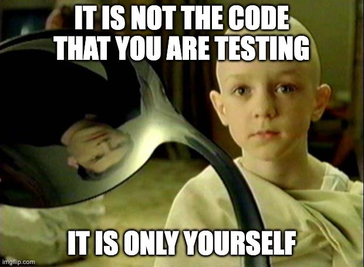

# Testing for audits: there is no spoon

2023-10-26

## The auditor's thing
All auditors develop over time their habits, and some include DO and DON'T practices. For example, some always look at the docs before diving into the code, some force themselves to never do, and I admit there are very good reasons behind both approaches.

I don't have a strong opinion in the debate around docs, but I do have one with regard to tests, and in this post, I want to share it with you.

## The bias
Have you ever looked at the code you were auditing, then glanced at the tests, and thought "wow, these folks did a really good job at testing. This area seems well tested, it will take me ages before I find a low-severity here"? Well, to me it happened a couple of times, enough to realize that looking at tests never worked in favor of my motivation. This quickly killed my appetite for looking at tests, at all.

My thing quickly became: NOT looking at the existing tests for the project.

> 💡 _tip #1: forget about the tests that are already in place. While they serve a purpose, it's rarely the auditor's_

## The happy path test
However, seeing how some code works "in action" is a powerful tool to understand what it does, how it does it, and why it does it in the first place. So I end up writing my own tests to all the projects I audit.

My methodology is to focus on one functionality at the time; for it I would:
- figure out all the entry points that deal with it
- figure out and implement the most basic set up that would make it function
- call the functions that relate to it; the aim is to have a working "happy path"

The most important part in this process are failures. Failures are extremely valuable, because after a failure I start to debug, typically looking for answers to the following questions:
- is my happy path failing because I did not set the project up correctly?
- or maybe the project is not in a correct state to work properly?
- or maybe I am not using the right inputs?
- or maybe the functionality does a different thing than what I expect it to?

By searching for, and finally resolving the issues that made my happy path work (yay!), I secured a very stable ground to work on. I understand, because I successfully tried out:
- how the project should be set up to make the functionality work
- what is the state to make the functionality work
- what are some correct inputs
- the project's behavior

> 💡 _tip #2: start by quickly iterating on a few "happy path" tests; then, use tests to experiment with more complex and unusual scenarios_

## Reason 1: the spoon
So, actually, by setting up my happy path test, I did not really test much about the code; the happy path itself is something of course every developer of the project focused on already; it's of little value for the audit.

What I really did was testing myself, my understanding, my ability to set up the project and to have reasonable expectations about its behavior. And during my iterations to have the happy path working I refined all of these.

> 💡 _tip #3: do not look for shortcuts in your tests: the goal is **not** looking for vulnerabilities in the project, but rather surfacing & filling gaps in your understanding of it_

## Reason 2: the blind spots
Another reason for writing your own tests is that very often the people who write tests are the same who wrote the code in the first place. This means that the blind spots, or the situations that are not properly anticipated, are the same for the code (which may misbehave) and the tests (which may not reproduce these given situations).

We auditors are developers too, so we too have our own blind spots, but since we are not the same people who coded, our blind spots will be different. Our testing will therefore likely not cover the whole functionality tested by the developers, but may cover something they didn't, and that's some precious bug hunting field.

> 💡 _tip #4: your tests don't need to be perfect to be effective in helping you find bugs. They just need to be authentically yours_

## Reason 3: the PoC
Not all of my auditing is around testing. For example, in a one-week audit, I typically spend the first 2-3 days testing, **and ramping up my understanding**, and the remaining time checking the code line-by-line and reporting. 

Once I find something that *could be* a bug, having a testing framework in place helps me figure out if it's a real issue or not in minutes; and if it *is* an issue, I already have all it needs to prepare a runnable PoC to include in my report.

> 💡 _tip #5: time spent writing your own tests will also pay back with quicker verification and solid proving of your findings_

## Reason 4: the tools
For testing, like for auditing, there is no one-size-fits-all technique. 

Projects are very different, some for example benefit greatly from fuzzing and some others don't. However, the more you use your tools, the more you gain confidence using them. You'll also end up better knowing their limitations, writing your own tools or add-ons, and this knowledge will make you more and more efficient with time.

> 💡 _tip #6: time spent learning and customizing your tools will pay back with making your work more efficient_